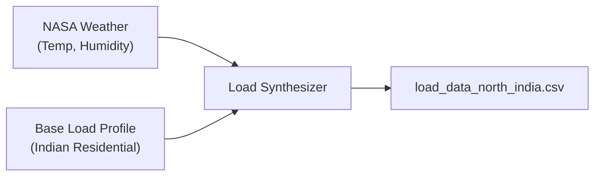

# Load Forecasting Model — Implementation Plan

## Overview

Predict **24-hour household electricity demand** for the same 5 Northern Indian cities used in the Solar Forecaster. This lets the Strategic LLM Agent balance supply (solar forecast) against demand (load forecast) for optimal P2P trading decisions.

**Model**: XGBoost Regressor | **Target**: MAPE < 15% | **Resolution**: Hourly

---

## Data Strategy: "Digital Twin" for Load

Unlike solar generation (driven purely by physics), household load is driven by **human behavior + weather**. Since no public hourly residential dataset exists for our exact cities, we will generate a realistic synthetic dataset using the same NASA POWER approach:

### Data Sources

| Source | What We Get | Purpose |
|:---|:---|:---|
| **NASA POWER API** | Hourly temperature (`T2M`) and humidity (`RH2M`) for 5 cities, 5 years | Weather-driven demand (AC in summer, heaters in winter) |
| **Statistical Load Profiles** | Typical Indian residential consumption curves | Base consumption patterns by hour-of-day and season |
| **BIS/CEA Standards** | Average per-capita kWh for urban North India | Calibration of absolute values |

### How It Works

1. **Base Profile**: A typical Indian household follows a predictable daily curve — low at night, morning peak (7–9 AM), afternoon dip, evening peak (6–10 PM).
2. **Weather Modulation**: When temperature > 30°C, AC usage spikes demand. When temp < 10°C, heater usage increases. Humidity amplifies the AC effect.
3. **Noise Injection**: Random ±10% variation per household to simulate real-world diversity.

---

## Dataset Schema

| Column | Role | Source |
|:---|:---|:---|
| `timestamp` | Index | NASA API |
| `city` | Feature | Config |
| `lat` / `lon` | Feature | Config |
| `temp_air` | **Feature** | NASA (`T2M`) |
| `humidity` | **Feature** | NASA (`RH2M`) |
| `hour` | **Feature** | Extracted |
| `month` | **Feature** | Extracted |
| `day_of_week` | **Feature** | Extracted |
| `is_weekend` | **Feature** | Derived |
| `load_lag_1h` | **Feature** | Shifted |
| `load_lag_24h` | **Feature** | Shifted |
| **`load_kw`** | **Target** | **Synthesizer** |

---

## Proposed Changes

### Predictive Engine Module

#### [NEW] `forecasting/load_data_curator.py`
- Fetch `T2M` and `RH2M` from NASA POWER API (reuse cached raw files from solar curator where possible)
- Implement `synthesize_load()` function with:
    - Base profile curve (24-hour pattern)
    - Seasonal scaling (summer peak, winter peak)
    - Weather-responsive modulation (temperature & humidity → AC/heater demand)
    - Random household variation (±10%)
- Output: `forecasting/data/load_data_north_india.csv`

#### [NEW] `forecasting/load_forecaster.py`
- `LoadForecaster` class mirroring `SolarForecaster` structure:
    - `load_data()`, `preprocess()`, `train()`, `predict_24h()`, `save_model()`, `load_model()`
- XGBoost with similar hyperparameters (tuned for load patterns)
- Full 24-hour MAPE (load happens 24/7, unlike solar)

#### [NEW] `forecasting/train_load.py`
- Training script analogous to `train_solar.py`
- Logs MAPE, RMSE, and feature importances

#### [NEW] `forecasting/visualize_load_results.py`
- Actual vs Predicted plot for a 72-hour window
- Feature importance chart
- Saves to `models/load forecaster/results/`

---

## Key Differences from Solar Forecasting

| Aspect | Solar | Load |
|:---|:---|:---|
| Active Hours | Daytime only (7 AM – 6 PM) | **24/7** |
| Primary Driver | GHI (Irradiance) | **Temperature + Time-of-Day** |
| Pattern | Bell curve (physics-driven) | **Double-peak** (behavior-driven) |
| MAPE Scope | Daytime only | **All hours** |
| Lag Features | 1h lag | **1h + 24h lag** (daily repetition is strong) |

---

## Verification Plan

### Automated Tests
- **Accuracy**: MAPE < 15% on 20% withheld test set
- **Command**: `python forecasting/train_load.py`

### Visual Verification
- Actual vs Predicted plot must show the characteristic "double-peak" pattern
- Feature importance must rank `hour` and `temp_air` in top 3
