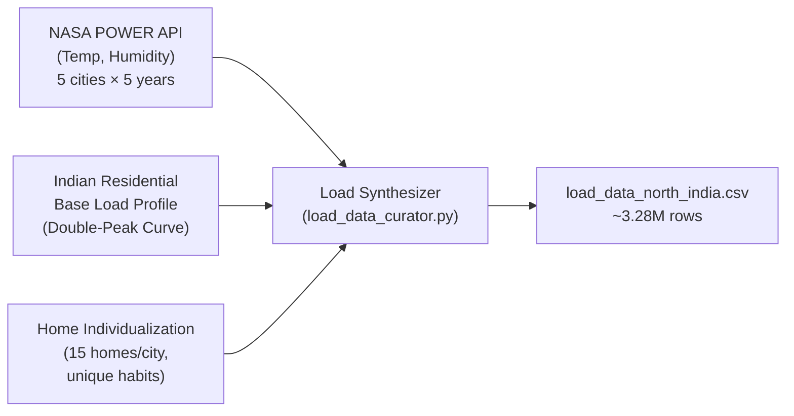
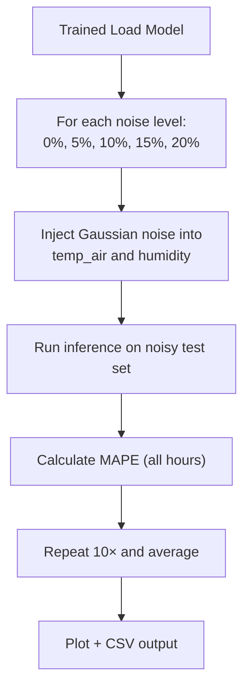
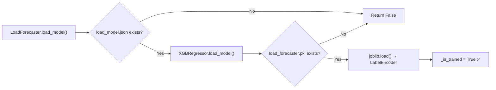

# Load Forecasting Model — Implementation Plan

## Overview

Predict **24-hour household electricity demand** for 5 Northern Indian cities (Delhi, Noida, Gurugram, Chandigarh, Dehradun). The model enables the Strategic LLM Agent to balance **supply** (solar forecast) against **demand** (load forecast) for optimal P2P trading and battery scheduling decisions.

**Model**: XGBoost Regressor | **Target**: MAPE < 15% | **Resolution**: Hourly | **Scope**: 24/7 (all hours)

---

## 1. Data Strategy: "Digital Twin" for Residential Load

Unlike solar generation (physics-driven), household load is driven by **human behavior + weather**. The curated dataset uses a realistic synthetic pipeline combining real satellite weather with behavioral models.

### 1.1 Data Sources

| Source | What We Get | Purpose |
|:---|:---|:---|
| **NASA POWER API** | Hourly `T2M` (temperature) and `RH2M` (humidity) for 5 cities, 5 years (2019–2023) | Weather-driven demand (AC in summer, heaters in winter) |
| **Statistical Load Profiles** | Typical Indian residential consumption curves (double-peak: morning + evening) | Base consumption patterns by hour-of-day and season |
| **BIS/CEA Standards** | Average per-capita kWh for urban North India | Calibration of absolute load values |

### 1.2 Synthesis Pipeline



### 1.3 Synthesis Logic

1. **Base Daily Profile**: Gaussian double-peak — morning surge (7–9 AM) and evening surge (6–10 PM) with night-time baseline.
2. **Weather Modulation**: Temperature > threshold → AC cooling load ramps nonlinearly. Temperature < threshold → heating load activates. Humidity amplifies cooling demand.
3. **Home Individualization**: 15 unique homes per city with seeded RNG controlling peak timings, base load, appliance sensitivity, and AC/heating thresholds.
4. **Noise Injection**: Multiplicative Gaussian noise (±12%) simulates random appliance switching.
5. **Weekend/Seasonal Scaling**: Weekends get 1.15× multiplier; seasonal cosine factor peaks in summer.

---

## 2. Dataset Schema

The curated dataset (`forecasting/data/load_data_north_india.csv`) contains **~3,285,000 rows** across 5 cities × 15 homes × 5 years.

| Column | Type | Role | Source |
|:---|:---|:---|:---|
| `timestamp` | datetime | Index | NASA API |
| `home_id` | string | Group Key | `{city}_{idx:02d}` |
| `city` | string | Feature (encoded) | Config |
| `lat` / `lon` | float | Feature | Config |
| `temp_air` | float | **Feature** | NASA `T2M` |
| `humidity` | float | **Feature** | NASA `RH2M` |
| `hour` | int | **Feature** | Extracted from timestamp |
| `month` | int | **Feature** | Extracted from timestamp |
| `day_of_week` | int | **Feature** | Extracted from timestamp |
| `is_weekend` | int | **Feature** | Derived (Sat/Sun = 1) |
| `load_lag_1h` | float | **Feature** | Shifted `load_kw` by 1 hour (per home) |
| `load_lag_24h` | float | **Feature** | Shifted `load_kw` by 24 hours (per home) |
| **`load_kw`** | float | **Target** | **Synthesizer** |

### Feature Engineering Rationale

| Feature | Why It Matters |
|:---|:---|
| `hour` | Captures the characteristic double-peak daily pattern |
| `temp_air` | Primary weather driver — triggers AC/heater load |
| `humidity` | Amplifies perceived heat → increases cooling demand |
| `is_weekend` | Weekend occupancy is higher → 15% more consumption |
| `load_lag_1h` | Short-term memory — detects trending usage |
| `load_lag_24h` | Daily repetition — households repeat behavior patterns |
| `city_encoded` | Captures city-specific climate and elevation effects |
| `lat` / `lon` | Geospatial signal for cross-city generalization |

---

## 3. Proposed File Structure

```
Project-grid/
├── forecasting/
│   ├── data/
│   │   └── load_data_north_india.csv        ← [EXISTS] Curated dataset
│   ├── load_data_curator.py                  ← [EXISTS] Data synthesis pipeline
│   ├── load_forecaster.py                    ← [NEW]    LoadForecaster class
│   ├── train_load_forecaster.py              ← [NEW]    Training entry point
│   ├── visualize_load_results.py             ← [NEW]    Visualization & plots
│   └── load_sensitivity_analysis.py          ← [NEW]    Weather uncertainty analysis
│
└── models/
    └── load forecaster/
        ├── load_model.json                   ← [NEW]    XGBoost model weights
        ├── load_forecaster.pkl               ← [NEW]    Pickled LabelEncoder + metadata
        └── results/
            ├── LOAD_FORECASTING_REPORT.md    ← [NEW]    Performance report
            ├── load_forecast_plot.png         ← [NEW]    Actual vs Predicted (72h)
            ├── load_feature_importance.png    ← [NEW]    Feature importance chart
            ├── sensitivity_analysis.png       ← [NEW]    Weather uncertainty chart
            └── sensitivity_results.csv        ← [NEW]    Raw sensitivity numbers
```

---

## 4. Proposed Changes — Detailed Specifications

### 4.1 [NEW] `forecasting/load_forecaster.py`

The core ML module, mirroring `SolarForecaster` architecture exactly.

#### Class: `LoadForecaster`

```python
FEATURE_COLS = [
    'temp_air', 'humidity',
    'hour', 'month', 'day_of_week', 'is_weekend',
    'lat', 'lon',
    'load_lag_1h', 'load_lag_24h',
    'city_encoded'
]

TARGET_COL = 'load_kw'
```

| Method | Signature | Responsibility |
|:---|:---|:---|
| `__init__` | `(self, model_dir="models/load forecaster")` | Initialize model, LabelEncoder, `_is_trained` flag |
| `load_data` | `(self, csv_path: str) → pd.DataFrame` | Read CSV, parse dates, print row/city/home counts |
| `preprocess` | `(self, df: pd.DataFrame) → pd.DataFrame` | Encode `city` via LabelEncoder, drop NaN targets, clip `load_kw ≥ 0.04`, validate lag columns exist |
| `train` | `(self, df: pd.DataFrame) → dict` | Chronological 80/20 split, train XGBoost, evaluate on all hours (no daytime mask), return `{rmse, mape}`, auto-save |
| `save_model` | `(self)` | Save `load_model.json` (XGBoost native) + `load_forecaster.pkl` (joblib: LabelEncoder) |
| `load_model` | `(self) → bool` | Load model + encoder from disk, return `True`/`False` |
| `predict_24h` | `(self, context_df, city, home_id) → list[float]` | Generate 24-hour forecast with auto-regressive lag rolling. Uses both `load_lag_1h` (rolling) and `load_lag_24h` (from context). |
| `feature_importance` | `(self) → pd.DataFrame` | Sorted feature importance DataFrame |

#### XGBoost Hyperparameters (Tuned for Load Patterns)

```python
xgb.XGBRegressor(
    n_estimators=800,          # More trees — load has subtler patterns than solar
    learning_rate=0.03,        # Lower LR to prevent overfitting on noise
    max_depth=7,               # Deeper trees — capture hour × temperature interactions
    subsample=0.75,
    colsample_bytree=0.8,
    min_child_weight=10,       # Higher — smooth out household noise
    reg_alpha=0.1,             # L1 regularization — feature selection pressure
    reg_lambda=1.0,            # L2 regularization — standard
    random_state=42,
    n_jobs=-1,
)
```

#### Key Differences from `SolarForecaster`

| Aspect | Solar | Load |
|:---|:---|:---|
| Active Hours | Daytime only (7 AM – 6 PM) | **24/7** |
| Primary Driver | GHI (Irradiance) | **Temperature + Hour-of-Day** |
| Pattern | Bell curve (physics) | **Double-peak** (behavior) |
| MAPE Scope | Daytime only (`power > 0.01`) | **All hours** |
| Lag Features | `power_lag_1h` only | **`load_lag_1h` + `load_lag_24h`** |
| Multi-entity | 1 panel per city | **15 homes per city** |
| Minimum clip | `0.0` kW | **`0.04` kW** (standby draw) |
| Model save dir | `models/solar forecaster/` | **`models/load forecaster/`** |
| Pickle file | `solar_forecaster.pkl` | **`load_forecaster.pkl`** |

#### `predict_24h` Auto-Regressive Logic

```python
def predict_24h(self, context_df, city, home_id=None):
    """
    Generate a 24-hour (hourly) load forecast.

    Parameters
    ----------
    context_df : pd.DataFrame
        Last 25+ hours of data for the target home/city.
        Must contain: timestamp, temp_air, humidity, lat, lon, load_kw
    city : str
        One of the 5 trained cities.
    home_id : str, optional
        Specific home. If None, forecasts aggregate city-level load.

    Returns
    -------
    list of 24 floats — predicted load_kw for the next 24 hours.
    """
    predictions = []
    for i in range(1, 25):
        next_ts = last_ts + pd.Timedelta(hours=i)
        row = {
            'temp_air':      last_row['temp_air'],     # from weather forecast
            'humidity':      last_row['humidity'],      # from weather forecast
            'hour':          next_ts.hour,
            'month':         next_ts.month,
            'day_of_week':   next_ts.dayofweek,
            'is_weekend':    int(next_ts.dayofweek >= 5),
            'lat':           last_row['lat'],
            'lon':           last_row['lon'],
            'load_lag_1h':   last_load,                 # auto-regressive roll
            'load_lag_24h':  context_24h_ago,           # from context history
            'city_encoded':  city_enc,
        }
        pred = max(0.04, float(model.predict(X)[0]))
        predictions.append(round(pred, 4))
        last_load = pred  # Roll forward
    return predictions
```

---

### 4.2 [NEW] `forecasting/train_load_forecaster.py`

Training entry-point script, mirroring `train_solar_forecaster.py`.

```python
"""
Load Forecasting Model — Training Script
=========================================
Usage:  python forecasting/train_load_forecaster.py

Trains the XGBoost model on the curated load dataset and saves:
  - models/load forecaster/load_model.json
  - models/load forecaster/load_forecaster.pkl
"""

DATA_PATH  = "forecasting/data/load_data_north_india.csv"
MODEL_DIR  = "models/load forecaster"

def main():
    # 1. Validate dataset exists
    # 2. Initialize LoadForecaster(model_dir=MODEL_DIR)
    # 3. Load CSV → load_data(DATA_PATH)
    # 4. Train → train(df)  (prints split sizes, progress, final metrics)
    # 5. Print feature importances (top 11 features)
    # 6. Print RMSE, MAPE, pass/fail vs 15% target
```

**Expected Console Output:**
```
==================================================
  Load Demand Forecasting — Training
==================================================
Loading dataset from: forecasting/data/load_data_north_india.csv
  Loaded 3,285,000 rows from 5 cities, 75 homes.
  After preprocessing: 3,285,000 rows, 5 cities.

Training split  : 2,628,000 rows
Test split      : 657,000 rows

Training XGBoost model...
[0]     validation_0-rmse:0.xxxxx
[100]   validation_0-rmse:0.xxxxx
...

========================================
 RMSE : X.XXXX kW
 MAPE : X.XX%  (all hours)
========================================
Model saved to 'models/load forecaster/'

--- Feature Importances ---
    feature    importance
       hour        0.XXXX
   temp_air        0.XXXX
load_lag_1h        0.XXXX
        ...

Final Results:
  RMSE : X.XXXX kW
  MAPE : X.XX%

  Target MAPE < 15% achieved!
```

---

### 4.3 [NEW] `forecasting/visualize_load_results.py`

Generate publication-quality visualizations for the performance report.

#### Plot 1: Actual vs Predicted (72-hour window)

- Select one city (Delhi) and one home (`Delhi_00`)
- Take the **last 72 hours** of the test set
- Overlay `Actual load_kw` (orange solid) vs `Predicted load_kw` (blue dashed)
- Must clearly show the **double-peak** pattern (morning + evening)
- Save to: `models/load forecaster/results/load_forecast_plot.png`

#### Plot 2: Feature Importance Bar Chart

- Horizontal bar chart of all 11 features sorted by importance
- Color: teal/dark blue
- Save to: `models/load forecaster/results/load_feature_importance.png`

#### Expected Feature Importance Ranking

| Rank | Feature | Expected Importance | Rationale |
|:---|:---|:---|:---|
| 1 | `hour` | ~30–40% | Dominant driver of the daily profile |
| 2 | `temp_air` | ~15–25% | AC/heater activation |
| 3 | `load_lag_1h` | ~10–15% | Short-term memory effect |
| 4 | `load_lag_24h` | ~8–12% | Daily repetition pattern |
| 5 | `humidity` | ~5–8% | Amplifies cooling demand |

---

### 4.4 [NEW] `forecasting/load_sensitivity_analysis.py`

Quantify model robustness to weather forecast uncertainty, mirroring `sensitivity_analysis.py`.

#### Methodology



| Config | Value |
|:---|:---|
| **Noise levels** | `[0, 5, 10, 15, 20]` percent |
| **Weather columns perturbed** | `temp_air`, `humidity` (load's weather drivers) |
| **Monte Carlo trials** | 10 per noise level |
| **Physics constraint** | `humidity ∈ [0, 100]`, `load_kw ≥ 0.04` |

**Key Difference from Solar**: Solar perturbs `[ghi, temp_air, wind_speed]`. Load perturbs `[temp_air, humidity]` — the two weather drivers of demand.

#### Outputs

- `models/load forecaster/results/sensitivity_analysis.png` — Publication chart with error bands and industry benchmark overlay
- `models/load forecaster/results/sensitivity_results.csv` — Raw numbers

---

### 4.5 [NEW] `models/load forecaster/results/LOAD_FORECASTING_REPORT.md`

Auto-generated after training + visualization, mirroring `SOLAR_FORECASTING_REPORT.md`.

#### Report Structure

```markdown
# Load Demand Forecasting — Performance Report

## 1. Executive Summary
Brief — model purpose, architecture, cities covered.

## 2. Model Performance Metrics
| Metric | Value | Target | Status |
| MAPE   | X.XX% | < 15%  | ✅/❌  |
| RMSE   | X.XXXX kW | — | — |
| Training / Test samples | — | — | — |

## 3. Visual Validation
### 3.1 Actual vs Predicted Load

Key observations: double-peak, night baseline, trend capture.

### 3.2 Feature Importance

Ranking analysis with rationale.

## 4. Sensitivity Analysis
| Noise | MAPE | Context |
Table + chart + insight.

## 5. Conclusion
Summary of results, confidence level for LLM Agent integration.
```

---

## 5. Model Artifacts — Persistence Strategy

Exactly mirroring the solar forecaster's artifact structure:

| File | Format | Contents | How Created |
|:---|:---|:---|:---|
| `load_model.json` | XGBoost native JSON | Model weights, tree structure, hyperparams | `xgb_model.save_model()` |
| `load_forecaster.pkl` | Python pickle (via joblib) | `LabelEncoder` (city name ↔ int mapping) | `joblib.dump()` |

### Load Flow



---

## 6. Integration with Strategic LLM Agent

Once trained, the model plugs into the existing microgrid pipeline:

```python
from forecasting.load_forecaster import LoadForecaster

# At startup
load_model = LoadForecaster(model_dir="models/load forecaster")
load_model.load_model()

# At decision time
demand_24h = load_model.predict_24h(recent_data, city="Delhi")
supply_24h = solar_model.predict_24h(recent_data, city="Delhi")

# Net = Supply - Demand → drives battery + P2P trading decisions
net_energy = [s - d for s, d in zip(supply_24h, demand_24h)]
```

---

## 7. Execution Order

| Step | Command | Depends On | Output |
|:---|:---|:---|:---|
| 1 | `python forecasting/load_data_curator.py` | Internet (NASA API) | `forecasting/data/load_data_north_india.csv` (**already done ✅**) |
| 2 | Implement `forecasting/load_forecaster.py` | Step 1 dataset schema | `LoadForecaster` class |
| 3 | Implement `forecasting/train_load_forecaster.py` | Step 2 | Training script |
| 4 | `python forecasting/train_load_forecaster.py` | Step 2, 3 | `models/load forecaster/load_model.json` + `load_forecaster.pkl` |
| 5 | Implement `forecasting/visualize_load_results.py` | Step 4 model | Visualization script |
| 6 | `python forecasting/visualize_load_results.py` | Step 4, 5 | `load_forecast_plot.png` + `load_feature_importance.png` |
| 7 | Implement `forecasting/load_sensitivity_analysis.py` | Step 4 model | Sensitivity script |
| 8 | `python forecasting/load_sensitivity_analysis.py` | Step 4, 7 | `sensitivity_analysis.png` + `sensitivity_results.csv` |
| 9 | Write `LOAD_FORECASTING_REPORT.md` | Steps 4, 6, 8 metrics | Final performance report |

---

## 8. Verification Plan

### 8.1 Automated Tests

| Test | Command | Pass Criteria |
|:---|:---|:---|
| **Model Accuracy** | `python forecasting/train_load_forecaster.py` | MAPE < 15% on 20% withheld test set |
| **Model Persistence** | Load → predict → compare | `load_model()` returns `True`, predictions match |
| **Sensitivity Robustness** | `python forecasting/load_sensitivity_analysis.py` | MAPE < 15% at 10% weather noise |

### 8.2 Visual Verification

- **Actual vs Predicted plot** must show the characteristic **double-peak** pattern (morning + evening surges)
- **Night-time baseline** must be accurately predicted (low but non-zero — unlike solar which goes to zero)
- **Feature importance** must rank `hour` and `temp_air` in the **top 3**
- **Sensitivity chart** must show graceful degradation, not a cliff

### 8.3 Sanity Checks

| Check | Expected |
|:---|:---|
| All predictions > 0.04 kW | ✅ Homes always have standby draw |
| Evening peak > Morning peak | ✅ Matches Indian residential pattern |
| Summer load > Winter load (Delhi) | ✅ AC dominates |
| Weekend load > Weekday load | ✅ Higher occupancy |

---

## 9. Key Differences from Solar Forecasting

| Aspect | Solar Forecaster | Load Forecaster |
|:---|:---|:---|
| **What it predicts** | Solar panel power output (kW) | Household electricity demand (kW) |
| **Active hours** | Daytime only (≈7 AM–6 PM) | **24/7** (load never hits zero) |
| **Primary driver** | GHI (sunlight intensity) | **Temperature + Time-of-Day** |
| **Daily pattern** | Single bell curve | **Double-peak** (morning + evening) |
| **MAPE calculation** | Daytime only (`power > 0.01`) | **All hours** (load is always > 0) |
| **Lag features** | `power_lag_1h` | **`load_lag_1h` + `load_lag_24h`** |
| **Data entities** | 1 panel per city (5 total) | **15 homes per city (75 total)** |
| **Minimum value** | 0.0 kW (night) | **0.04 kW (standby)** |
| **Weather sensitivity** | `ghi, temp_air, wind_speed` | **`temp_air, humidity`** |
| **Weather perturbed in SA** | `ghi, temp_air, wind_speed` | **`temp_air, humidity`** |
| **Regularization** | Standard | **Stronger** (more noise in data) |
| **n_estimators** | 500 | **800** (subtler patterns) |
| **Model directory** | `models/solar forecaster/` | **`models/load forecaster/`** |
| **Pickle artifact** | `solar_forecaster.pkl` | **`load_forecaster.pkl`** |

---
