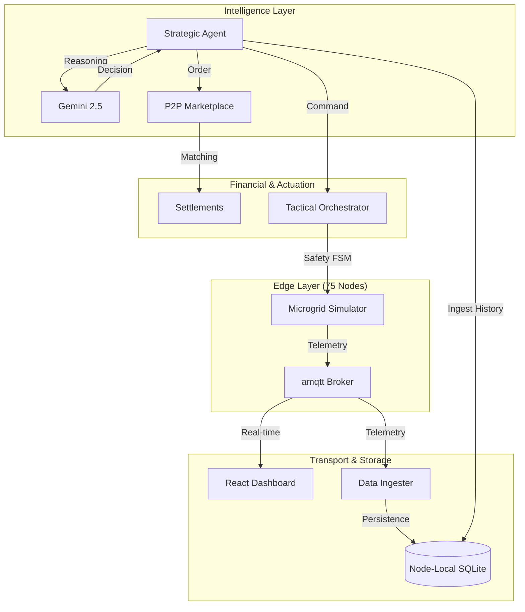

# ⚡ Honeybee — Distributed Intelligent Microgrid

<div align="center">


**A high-fidelity regional microgrid platform for Northern India. Combines physical physics simulations, XGBoost-powered predictive engines, and Gemini LLM Strategic Agents to enable intelligent P2P energy trading.**

</div>

---

## 🏗️ System Architecture

Honeybee operates on a **"Hub-and-Spoke"** architecture centered around a low-latency MQTT broker. It bridges physical sensor simulation with high-level LLM reasoning.



> [!NOTE]
> For a deep-dive into the FSM logic, CDA clearing math, and MQTT protocols, see [TECHNICAL_DOCUMENTATION.md](./TECHNICAL_DOCUMENTATION.md).

---

## 📊 Core Performance

### 1. Forecast Accuracy (XGBoost)
The system uses 5 years of **NASA POWER API** data to forecast solar generation and residential demand across 5 major Indian cities.

| Model | MAPE | RMSE | Data |
|:---|:---|:---|:---|
| **Solar Forecaster** | **2.84%** | 0.0088 kW | 175K rows (5 cities × 5 years) |
| **Load Forecaster** | **13.95%** | 0.2066 kW | 3.28M rows (75 homes × 5 years) |

### 2. Strategic "Deep-and-Wide" AI
*   **Wide Layer**: Processes 74 nodes using batch reasoning to maintain cluster-wide situational awareness.
*   **Deep Layer**: A dedicated Gemini reasoning core for the showcase node, providing full Chain-of-Thought (CoT) transparency.

---

## 🚀 Quick Start

### 1. Setup Environment
```bash
git clone https://github.com/theabhinav0231/Intelligent-Microgrid.git
cd Intelligent-Microgrid
pip install -r requirements.txt
```

### 2. Launch the Ecosystem (8 Terminals)
Refer to the [RUNBOOK.md](./RUNBOOK.md) for detailed terminal sequencing. The typical order is:
1.  **Hub**: `python -m edge.broker`
2.  **Exchange**: `uvicorn marketplace.main:app`
3.  **Data**: `python -m edge.run_node`
4.  **Physics**: `python -m edge.run_simulator`
5.  **Safety**: `python -m orchestrator.multi_orchestrator_runner`
6.  **AI (Wide)**: `python -m strategic_agent.multi_agent_runner`
7.  **AI (Deep)**: `python -m strategic_agent.run_agent --node-id delhi_01`
8.  **HUD**: `cd dashboard && npm run dev`

---

## 🌍 Cities Covered
| City | Elevation | Climate | Lat/Lon |
|:---|:---|:---|:---|
| **Delhi** | 216m | Hot semi-arid | 28.61, 77.21 |
| **Noida** | 200m | Hot semi-arid | 28.54, 77.39 |
| **Gurugram** | 217m | Hot semi-arid | 28.46, 77.03 |
| **Chandigarh** | 321m | Humid subtropical | 30.73, 76.78 |
| **Dehradun** | 640m | Humid subtropical | 30.32, 78.03 |

---

## 🔬 Methodology Overview

*   **P2P Trading**: Continuous Double Auction (CDA) with midpoint clearing. Proximity-based tier matching minimizes simulated transmission loss.
*   **Safety Layer**: Tactical Orchestrator with a Finite State Machine (FSM) managing `EMERGENCY`, `ISLANDED`, and `TRADING` states.
*   **Privacy**: Individual node telemetry remains local (SQLite). Only anonymized `NodeSummary` packets are sent for AI reasoning.

---

## 📦 Tech Stack
*   **Backend**: Python, FastAPI, SQLAlchemy, Paho-MQTT, amqtt.
*   **AI/ML**: XGBoost, Scikit-learn, PVLib, Google Gemini 2.5 API.
*   **Frontend**: React, Vite, TailwindCSS, Lucide Icons, MQTT over WebSockets.

---

<div align="center">
  <b>Honeybee — Building a Smarter, Decentralized Energy Future.</b>
</div>
