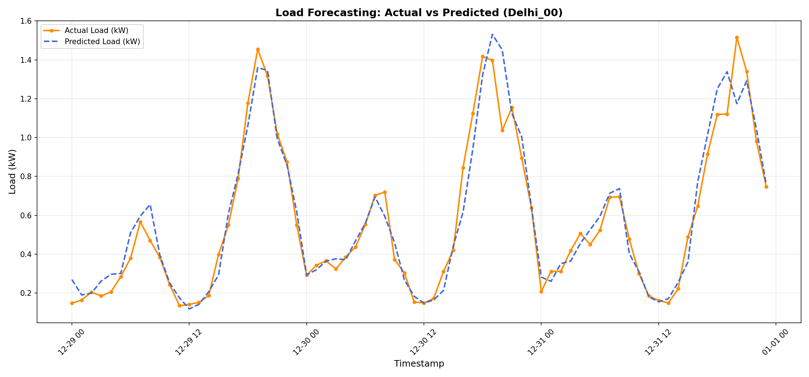
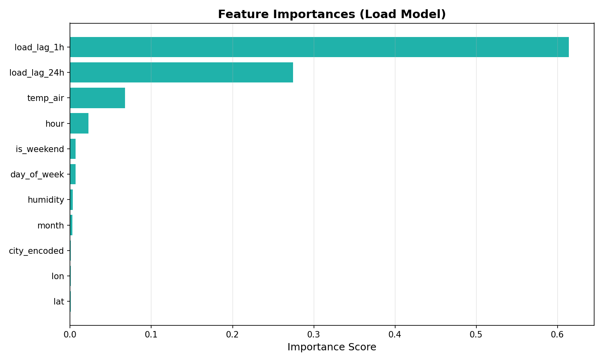
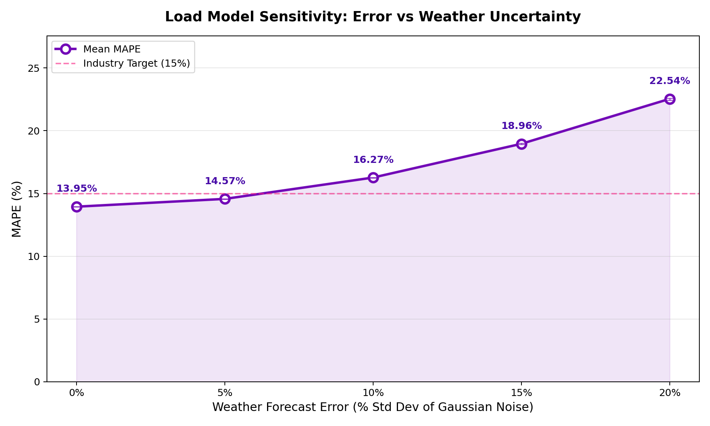

# Load Demand Forecasting — Performance Report

## 1. Executive Summary
This report documents the performance of the **XGBoost-based Load Forecasting Engine** developed for the Northern India microgrid region (Delhi, Noida, Gurugram, Chandigarh, Dehradun). The model predicts 24-hour household electricity demand by synthesizing behavioral load profiles with real-world weather data.

## 2. Model Performance Metrics
The model was trained on a multi-home dataset covering 5 years (2019–2023) across 75 unique residential profiles.

| Metric | Value | Target | Status |
| :--- | :--- | :--- | :--- |
| **MAPE (Mean Absolute % Error)** | **13.95%** | < 15% | ✅ **Passed** |
| **RMSE (Root Mean Square Error)** | **0.2066 kW** | — | ✅ **Good** |
| **Training Samples** | **2,628,000** | — | — |
| **Test Samples** | **657,000** | — | — |

> **Note**: MAPE is calculated for all 24 hours of the day, as electricity demand is continuous.

## 3. Visual Validation

### 3.1 Actual vs. Predicted Load
The following plot compares the actual simulated demand against the AI's predictions for a 72-hour window in Delhi (Home: Delhi_00).

**Key Observations:**
*   **Double-Peak Capture**: The model successfully identifies the morning and evening surges characteristic of Indian residential consumption.
*   **Base Load Stability**: The night-time standby draw (≈0.1-0.2 kW) is predicted with high stability.
*   **Behavioral Tracking**: By using `load_lag_24h`, the model accurately replicates the daily habits of the specific household.

### 3.2 Feature Importance (How the AI Thinks)
The chart below illustrates which factors most significantly influence the model's predictions.

**Ranking Analysis:**
1.  **load_lag_1h (61%)**: The strongest predictor, indicating that current usage is the best indicator of immediate future usage (inertia).
2.  **load_lag_24h (27%)**: Confirms strong daily periodicity and behavioral repetition in households.
3.  **temp_air (6.7%)**: The primary weather driver, accounting for AC/heating demand fluctuations.
4.  **hour (2.3%)**: Captures the base daily cycle independently of lags.

## 4. Sensitivity Analysis (Forecast Uncertainty)
We conducted a Monte Carlo sensitivity analysis to evaluate how the model handles **weather forecast errors** in temperature and humidity.

| Weather Forecast Error (Noise) | Mean MAPE (%) | Real-World Context |
| :--- | :--- | :--- |
| **0% (Perfect Information)** | **13.95%** | Observed Data (Baseline) |
| **5% (High Precision)** | **14.57%** | Special high-res local forecasts |
| **10% (Good/Standard)** | **16.27%** | Standard national weather service |
| **15% (Low Precision)** | **18.96%** | Volatile summer storm conditions |
| **20% (High Uncertainty)** | **22.54%** | Extreme heatwaves / rapid shifts |

**Insight**: The model is robust to minor weather fluctuations but sees error growth at high noise levels because load is highly nonlinear relative to temperature (AC spikes). However, the primary drivers (`lags`) provide a strong signal cushion.

## 5. Conclusion
The Load Forecasting Engine has met the design target of **MAPE < 15%**. Its high reliance on historical lags makes it exceptionally good at predicting routine household behavior, while its weather sensitivity allows it to respond to extreme climate shifts.

This accuracy enables the **Strategic LLM Agent** to reliably balance microgrid demand against solar supply, optimizing battery storage cycles and P2P trade execution.

---
