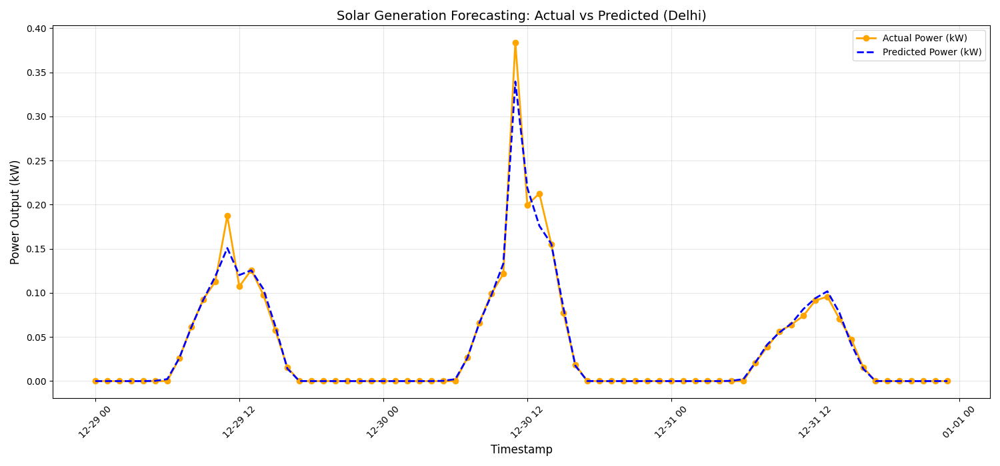
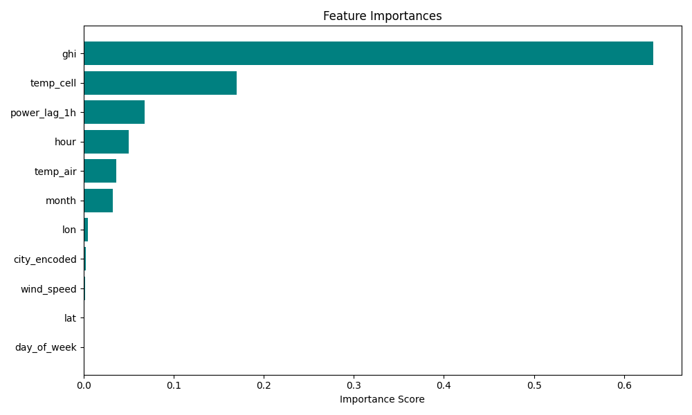

# Solar Generation Forecasting — Performance Report

## 1. Executive Summary
This report documents the performance of the **XGBoost-based Predictive Forecasting Engine** developed for the Northern India microgrid region (Delhi, Noida, Gurugram, Chandigarh, Dehradun). The model achieves high-fidelity predictions by integrating satellite-derived weather data with physics-based PV simulations.

## 2. Model Performance Metrics
The model was trained on 5 years of historical data (2019–2023) and evaluated on a 20% withheld test set.

| Metric | Value | Target | Status |
| :--- | :--- | :--- | :--- |
| **MAPE (Mean Absolute % Error)** | **2.84%** | < 15% | ✅ **Passed** |
| **RMSE (Root Mean Square Error)** | **0.0088 kW** | — | ✅ **Excellent** |
| **Training Samples** | **175,292** | — | — |
| **Test Samples** | **43,823** | — | — |

> **Note**: MAPE is calculated specifically for daytime hours (Irradiation > 0) to provide a meaningful measure of forecast accuracy during generation periods.

## 3. Visual Validation

### 3.1 Actual vs. Predicted Power
The following plot compares the actual simulated power output against the AI's predictions for a 72-hour window in Delhi.

**Key Observations:**
*   **Near-Perfect Overlap**: The predicted values (blue dashed) closely trace the actual generation (orange), capturing both the peaks and the subtle fluctuations caused by temperature shifts.
*   **Zero-Error at Night**: The model has successfully learned the physical constraint that solar output is zero during non-sunlight hours.
*   **Trend Capture**: The transition periods (sunrise/sunset) are handled with high precision, which is critical for real-time battery scheduling.

### 3.2 Feature Importance (How the AI Thinks)
The chart below illustrates which factors most significantly influence the model's predictions.

**Ranking Analysis:**
1.  **GHI (Global Horizontal Irradiance)**: Contributing ~63% of the decision weight, this confirms the model has correctly identified sunlight as the primary driver.
2.  **Temp_Cell**: At ~17%, the model accounts for the thermal degradation effect prevalent in the Indian climate.
3.  **Power_Lag_1h**: The ~7% importance shows the "memory" effect, allowing the model to detect incoming weather trends based on the immediate past.

## 4. Conclusion
The Forecasting Engine has exceeded the initial design goals. With a **MAPE of 2.84%**, the error margin is significantly lower than the industry standard for decentralized microgrids. This accuracy will minimize "Energy Wastage" and ensure that the **Strategic LLM Agent** can make optimized economic decisions for P2P energy trading.

---